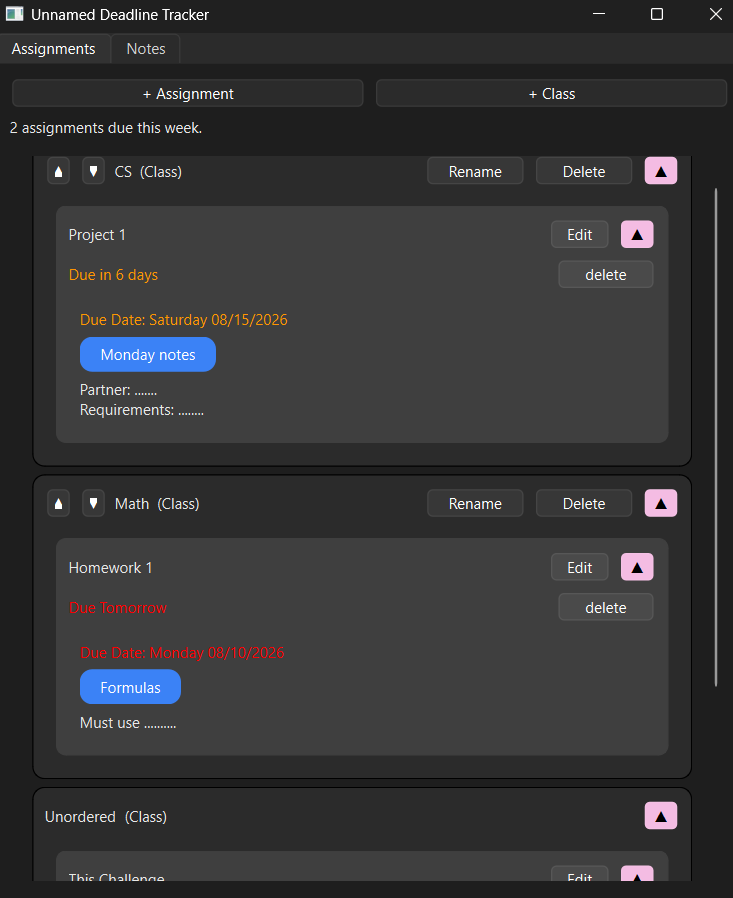
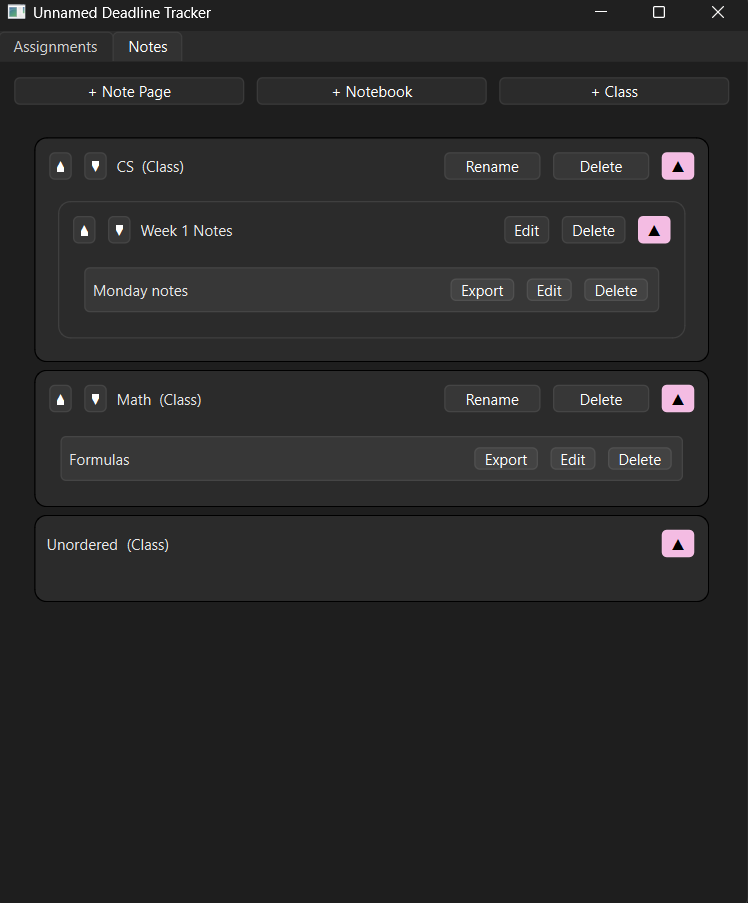
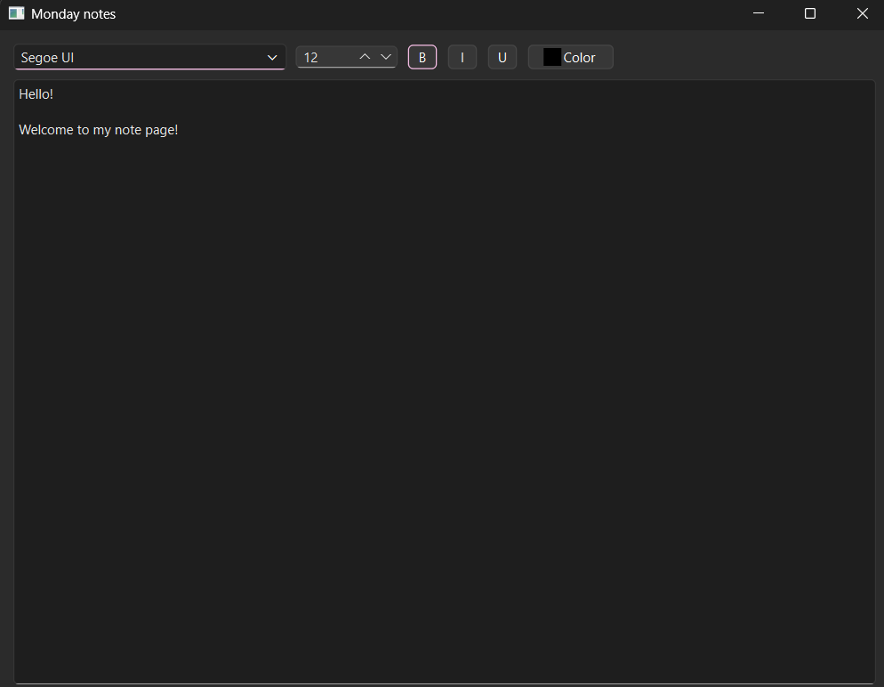

# Unnamed Deadline Tracker

A lightweight tool for keeping track of assignments and organizing notes in one place.

## Features

- View assignment details (due dait, requirements) and group them by class
- Write notes and organize them in groups
- Link notes to assignments to remember what's useful
- Export notes to word documents

 
 


## Tech Stack

- **Python** — core language
- **PySide6** — GUI framework 
- **BeautifulSoup4** — HTML parsing
- **htmldocx** — converting HTML content to Word (.docx) documents

## Installation and Usage

Clone the repository to an empty folder

To use the project, run the main.py file

```shell
git clone https://github.com/you/project.git
python src/main.py
```

## License

This project is licensed under the MIT License – see the LICENSE file for details.
